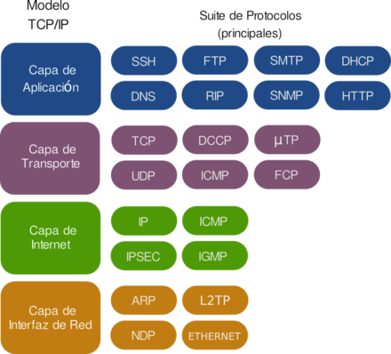

## Familia de protocolos de internet

### HTTP

**"HyperText Transfer Protocol"** define el formato y la forma de transmitir
los mensajes dentro de la **"World Wide Web"**. El protocolo es **"stateless"**
lo cual hace independiente cada comando del anterior y del siguiente. Existen
códigos de estatus del comando, los cuáles definen los errores y los éxitos del
comando. (505, 502, 200, etc.)
[Más códigos ->](https://kinsta.com/blog/http-status-codes/)

[Referencia Webopedia](https://www.webopedia.com/TERM/W/World_Wide_Web.html)

### TCP / IP

Usando en 1970 en ARPANET (primera WAN), son las normas que permiten a los
dispositivos intercambiar información en una red. TCP (Transmission control
Protocol) existe en la capa de transporte mientras que IP (Interet protocol)
en la capa de red. TCP así como UDP (User Datagram Protocol) se utilizan para
dividir un mensaje en varias partes y que estas puedan ser interpretadas por
el receptor.

### FTP

"File Transfer Protocol" es otro protocolo de Capa Aplicación que se utiliza
para la transferencia de archivos.

(Referencia IBM)[https://www.ibm.com/support/knowledgecenter/es/ssw_aix_72/network/tcpip_protocols.html]
