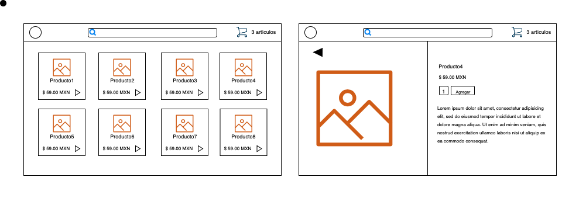

# Angular

## Temas

* Angular CLI [->](./angular-cli.md)
* Angular material [->](./angular-material.md)
* Typescript [->](./typescript.md)

* Data binding [->](./data-binding.md)
* Ng Built-in directives & pipes [->](./ng-built-in-directives-pipes.md)

* Components [->](./components.md)
* Inputs & Outputs [->](./inputs-outputs.md)

* Routing [->](./routing.md)

* E-commerce [->](./e-commerce.md)

## Objetivo

Crear dos pantallas funcionales con información estática.

Pantalla 1: Inicio - se debe mostrar un "header" con un logo, una barra para buscar y un botón para abrir el carrito, deberá tener una lista de productos donde cada producto dirige a una ruta nueva con un id del producto.

Pantalla 2: Producto: - se debe mostrar la información del producto de acuerdo al id de la ruta del producto. Se podrá agregar el producto a un carrito.

