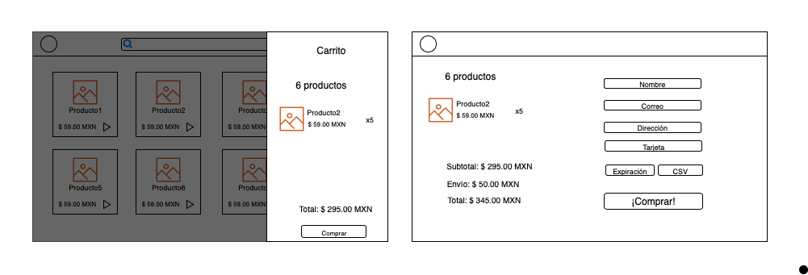

## Angular

### Temas

* Observables [->](./observables.md)
* Services [->](./services.md)
* HttpClient [->](./http-client.md)

* ReactiveForms [->](.reactive-forms.md)

* e-commerce [->](.e-commerce.md)

* CLI build [->](./cli-build.md)
* Extras:
  * Animations
  * Custom directives & pipes

### Objetivo

Crear dos pantallas funcionales con información estática.

Pantalla 2: Carrito - se debe mostrar un menú lateral donde se muestre una lista de los productos seleccionados y la cantidad total. También deberá mostrar el costo total y un botón que envíe a la página de "checkout".

Pantalla 3: Checkout: - se mostrará el carrito así como el costo de envío y el total final, deberá tener una forma para llenar la información del usuario, al realizar la compra deberá mostrar un mensaje de confirmación.

